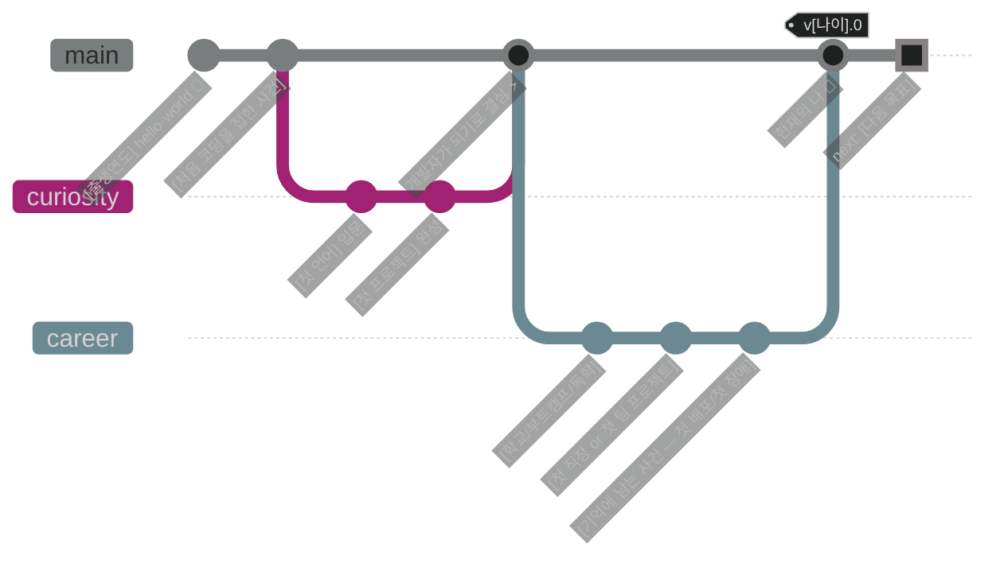
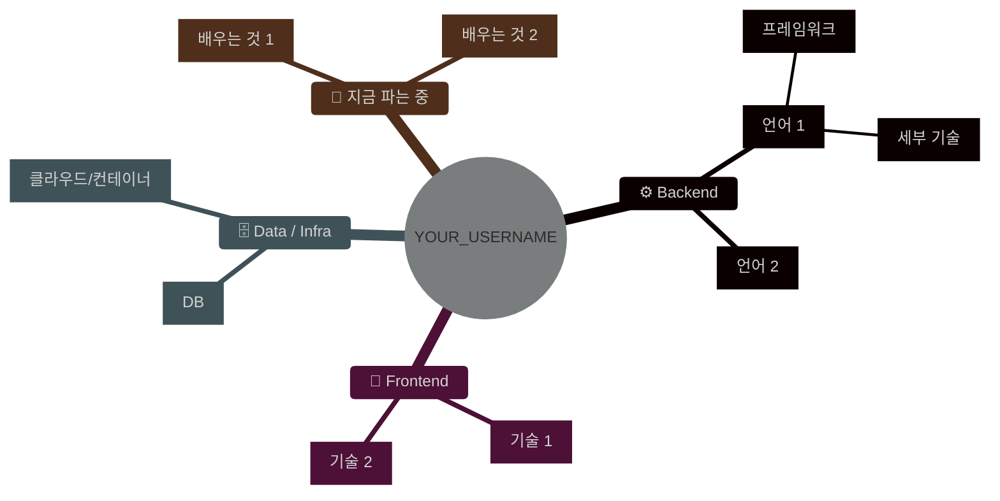
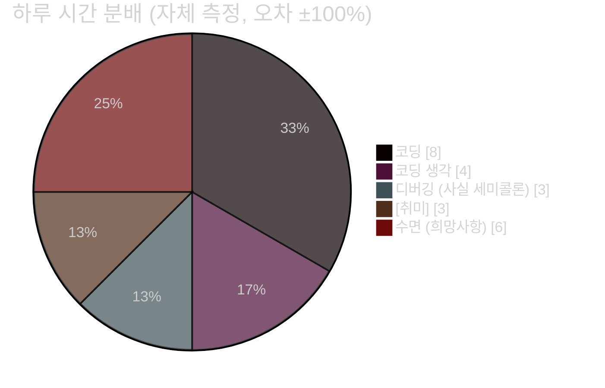
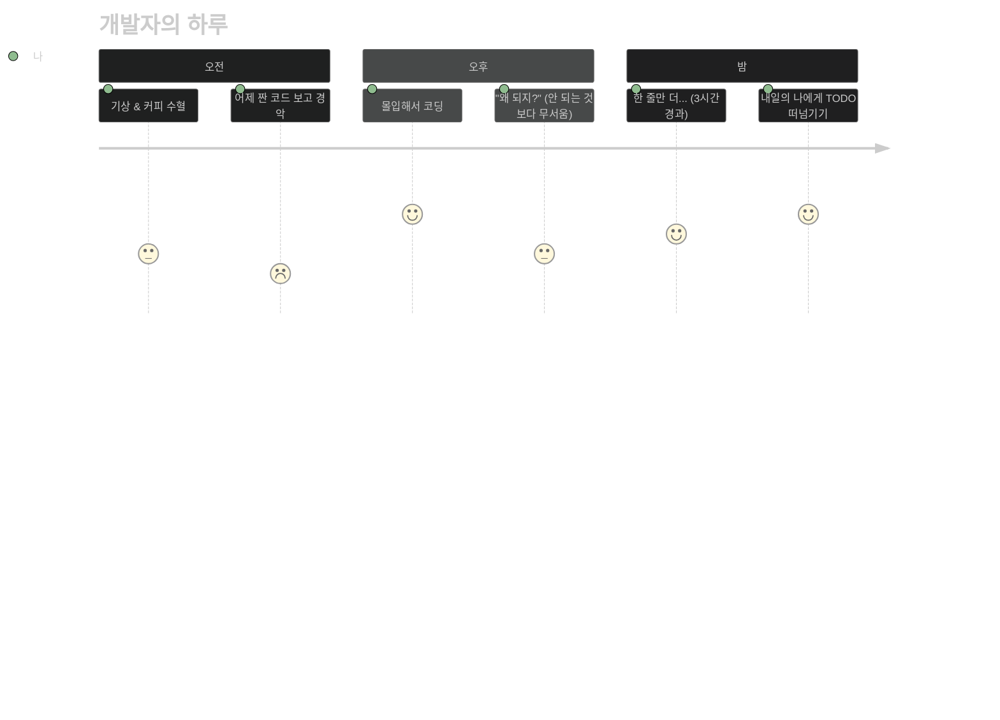

<!-- ============================================================
     🖥️ "TERMINAL OS" GITHUB PROFILE — 특수 기능형 템플릿
     흔한 뱃지/스탯카드 없이, 깃허브가 실제로 렌더링해주는
     숨은 기능들로만 만든 프로필입니다.

     들어간 특수 기능:
       · 가짜 OS 부팅 시퀀스 + neofetch 자기소개
       · 다크모드/라이트모드를 "감지"해서 다른 화면을 보여주는 <picture> 트릭
       · Mermaid 다이어그램 4종 (커리어 gitGraph / 스킬 마인드맵 / 하루 일과 / 파이차트)
       · 클릭해서 탐험하는 <details> 가짜 파일시스템
       · 이슈 한 번으로 서명되는 "방명록 버튼" (URL 프리필)
       · LaTeX 수식 자기소개
       · 소스 보기로만 찾을 수 있는 이스터에그
       · (선택) 매일 자동 갱신되는 나이/업타임 GitHub Action

     사용법:
       1. YOUR_USERNAME 전체 치환 → 본인 아이디
       2. [대괄호] 내용 교체
       3. README.md 로 이름 변경 후 YOUR_USERNAME/YOUR_USERNAME 리포에 업로드
     ============================================================ -->

<!-- 🕵️ 이스터에그 #1: 소스를 열어본 당신, 이미 상위 1% 방문자입니다.
     "코드를 읽는 자만이 진실을 본다" — 여기까지 온 김에 방명록에 서명하고 가세요. -->

```console
$ ssh visitor@github.com/YOUR_USERNAME
Warning: Permanently added 'YOUR_USERNAME' to the list of interesting people.

[  OK  ] Mounting /dev/coffee ..................... done
[  OK  ] Starting passion.service ................. done
[  OK  ] Loading side_projects.ko ................. 47 modules
[ WARN ] sleep.service failed to start (retrying since [출생연도])
[  OK  ] Reached target: Developer Mode

Welcome to YOUR_USERNAME OS — uptime: [나이]년째 무중단 가동 중
Last login: 방금 전, 바로 당신
```

<!-- 🌗 다크/라이트 모드 감지 트릭:
     GitHub는 <picture> 태그의 prefers-color-scheme을 지원합니다.
     보는 사람의 테마에 따라 다른 인사말이 나타납니다. -->
<div align="center">
  <picture>
    <source media="(prefers-color-scheme: dark)" srcset="https://capsule-render.vercel.app/api?type=transparent&text=🌙%20다크모드%20유저시군요.%20동료를%20만났습니다.&fontColor=79c0ff&fontSize=24&height=60" />
    <source media="(prefers-color-scheme: light)" srcset="https://capsule-render.vercel.app/api?type=transparent&text=☀️%20라이트모드로%20코딩을...%20용감하시네요.&fontColor=d29922&fontSize=24&height=60" />
    
  </picture>
</div>

## `$ neofetch`

```text
                   -`                    visitor@YOUR_USERNAME
                  .o+`                   ─────────────────────
                 `ooo/                   OS        : Human v[나이].0 (Seoul Edition)
                `+oooo:                  Host      : [소속 — 회사/학교]
               `+oooooo:                 Kernel    : [핵심 정체성 — 예: backend-6.1.0-lts]
               -+oooooo+:                Uptime    : [경력/코딩 시작 후 경과]년
             `/:-:++oooo+:               Shell     : [주력 언어] (login shell)
            `/++++/+++++++:              Packages  : [보유 기술 수]개 (직접 컴파일)
           `/++++++++++++++:             Resolution: 문제해결 x 몰입
          `/+++ooooooooooooo/`           DE        : [주력 프레임워크]
         ./ooosssso++osssssso+`          Terminal  : [에디터 — 예: neovim]
        .oossssso-````/ossssss+`         CPU       : 카페인 구동 듀얼코어 (야간 오버클럭)
       -osssssso.      :ssssssso.        Memory    : 부족함 (새 지식으로 항상 스왑 중)
      :osssssss/        osssso+++.       Battery   : ████████░░ 80% ([충전 방법])
     /ossssssss/        +ssssooo/-
```

## `$ git log --graph --all` — 지금까지의 커밋 로그

<!-- Mermaid는 GitHub 마크다운에서 네이티브 렌더링됩니다. 이미지가 아니라 '코드'예요. -->



## `$ tree ~/skills` — 스킬 트리



## `$ crontab -l` — 나의 24시간





## `$ ls -la /` — 파일시스템 탐험하기

> 아래 폴더는 진짜로 클릭해서 열 수 있습니다. 원하는 곳부터 탐험하세요.

<details>
<summary>📁 <b>/projects</b> — 만든 것들 <code>drwxr-xr-x</code></summary>
<br/>

| 파일 | 설명 | 상태 |
|---|---|---|
| [`[프로젝트1].exe`](https://github.com/YOUR_USERNAME/REPO_1) | [한 줄 설명 — 어떤 문제를 풀었나] | 🟢 running |
| [`[프로젝트2].sh`](https://github.com/YOUR_USERNAME/REPO_2) | [한 줄 설명] | 🟡 beta |
| `[프로젝트3].zip` | [한 줄 설명] — 언젠가 압축 풀 예정 | ⚪ archived |

</details>

<details>
<summary>📁 <b>/experience</b> — 경력과 기록 <code>drwxr-xr-x</code></summary>
<br/>

- 💼 **[회사/조직]** — [역할] `([기간])`
  - [한 일과 성과 한 줄]
- 🏆 **[수상/자격증]** — [내용] `([연도])`
- ✍️ **[블로그/발표]** — [제목](https://YOUR_BLOG_URL)

</details>

<details>
<summary>📁 <b>/etc/philosophy</b> — 개발 철학 <code>drwxr--r--</code></summary>
<br/>

> [자신의 개발 철학이나 좋아하는 원칙 — 예: "동작하게 만들고, 옳게 만들고, 빠르게 만들어라"]

```python
while alive:
    problem = world.find_problem()
    solution = me.build(problem)   # 여기가 제일 재밌음
    me.learn(solution.mistakes)
```

</details>

<details>
<summary>🔒 <b>/root/secret</b> — 접근 권한 필요 <code>drwx------</code></summary>
<br/>

```
Permission denied? 아니요, 열어본 당신에게만 공개:
⚡ TMI: [남들이 잘 모르는 재미있는 사실 하나]
🎮 [숨겨두고 싶은 취미나 최애]
```

<sub>🕵️ 이스터에그 #2 발견! 남은 하나는 이 문서의 어딘가에... (힌트: 이미지에 마우스를 올려보세요)</sub>

</details>

## `$ sudo make friend` — 방명록

<!-- 클릭하면 제목/본문이 미리 채워진 이슈 작성 화면이 열립니다.
     방문자는 버튼 한 번으로 서명하고, 서명은 리포 이슈 탭에 쌓입니다. -->

<div align="center">

**이 프로필에 다녀간 흔적을 남겨주세요. 버튼 하나면 됩니다.**

[](https://github.com/YOUR_USERNAME/YOUR_USERNAME/issues/new?title=🖊️%20방명록%3A%20다녀갑니다!&body=%23%23%20안녕하세요!%0A%0A-%20어떻게%20오셨나요%3A%20%0A-%20남기고%20싶은%20말%3A%20%0A%0A(이%20이슈를%20제출하면%20서명%20완료!))
[](mailto:YOUR_EMAIL@example.com)

[📜 지금까지의 방명록 보기](https://github.com/YOUR_USERNAME/YOUR_USERNAME/issues?q=label%3Aguestbook)

</div>

## `$ cat /proc/me` — 수식으로 증명하는 나

<!-- GitHub는 LaTeX 수식도 렌더링합니다 -->

$$
\text{나} = \int_{[시작연도]}^{\infty} \Big( \text{호기심}(t) \times \text{꾸준함}(t) \Big) \, dt + C_{\text{커피}}
$$

$$
\lim_{n \to \infty} \left( \text{실패}_n \right) = \text{성장} \quad \text{(단, } n\text{번 모두 기록했을 때)}
$$

<details>
<summary>⚙️ <b>[선택] 이 프로필을 "살아있게" 만드는 자동화 장치</b> — 설치 5분</summary>
<br/>

`.github/workflows/uptime.yml` 로 저장하면, **매일 자정에 봇이 직접 커밋**해서
위 neofetch의 업타임 숫자를 실제 날짜 기준으로 갱신합니다. README가 스스로 나이를 먹습니다.

```yaml
name: daily-uptime
on:
  schedule:
    - cron: "0 15 * * *"   # 매일 00:00 KST
  workflow_dispatch:
permissions:
  contents: write
jobs:
  update:
    runs-on: ubuntu-latest
    steps:
      - uses: actions/checkout@v4
      - name: bump uptime
        run: |
          DAYS=$(( ($(date +%s) - $(date -d "[코딩 시작일 예: 2019-03-01]" +%s)) / 86400 ))
          sed -i "s/uptime: .*일째/uptime: ${DAYS}일째/" README.md
      - name: commit
        run: |
          git config user.name "uptime-bot"
          git config user.email "actions@github.com"
          git commit -am "chore: uptime++ 🤖" || echo "no change"
          git push
```

응용: 같은 방식으로 `sed` 대상만 바꾸면 **D-day 카운터, 오늘의 목표, 최근 블로그 글**도
매일 자동 갱신할 수 있습니다.

</details>

---

<div align="center">

```console
$ exit
Connection to YOUR_USERNAME closed.
세션은 종료됐지만, 방명록은 열려 있습니다. 👋
```

<!-- 🕵️ 이스터에그 #3: 아래 이미지의 alt 텍스트(마우스 오버/스크린리더)에 숨겨진 메시지가 있습니다 -->


</div>
