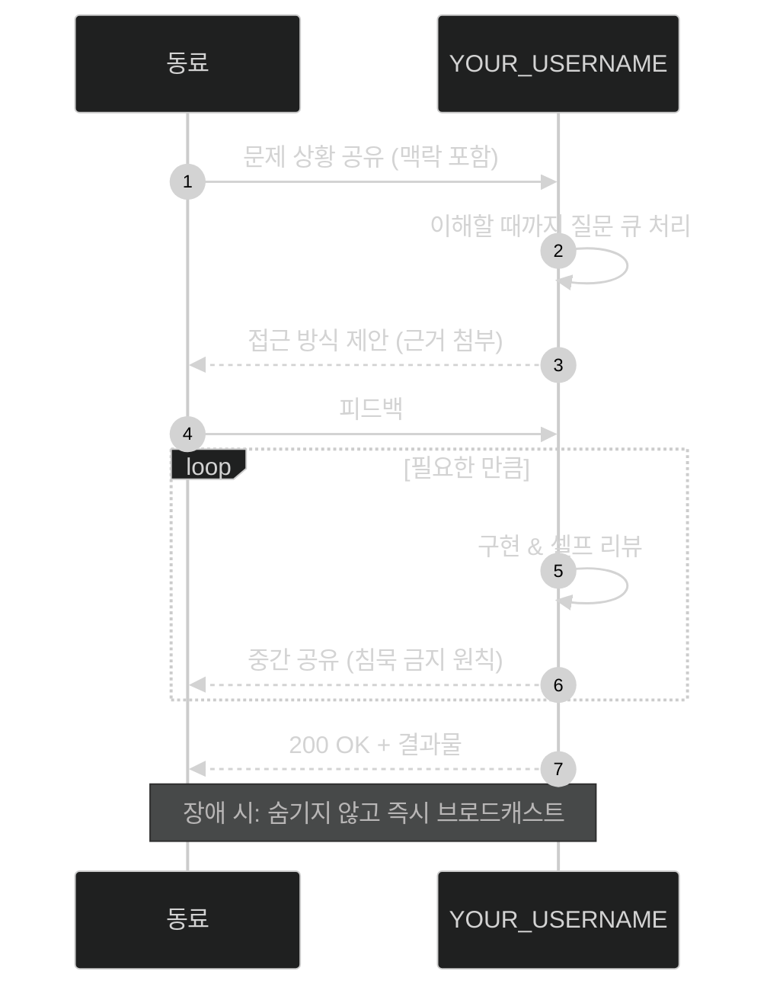

<!-- ============================================================
     📡 "REST API 공식 문서" GITHUB 프로필 템플릿 (v4)
     컨셉: 당신이라는 사람이 하나의 API 서비스이고,
     이 README는 그 서비스의 공식 개발자 문서입니다.
     개발자가 보는 순간 문법을 알아보고 웃게 되는 구조.

     이 버전만의 특수 기능:
       · 엔드포인트 문서 형식의 자기소개 (GET /profile, POST /contact ...)
       · 실제로 동작하는 응답 예시 — JSON 코드블록에 하이라이팅
       · 인증 실패(401), 접근 금지(403), 티팟(418) 등
         HTTP 상태코드로 만드는 유머와 정보 전달
       · Mermaid 시퀀스 다이어그램 = "나와 협업하는 법" 프로토콜 문서
       · 버전 체인지로그(semver) = 커리어 연혁
       · Rate Limit / SLA 표 = 성격과 일하는 방식
       · diff 코드블록으로 만드는 Before/After (성장 서사)
       · POST /contact 는 실제 프리필 이슈로 연결 — 문서인데 진짜 작동함

     사용법: YOUR_USERNAME 전체 치환 → [대괄호] 교체 → README.md로 개명
     ============================================================ -->

<div align="center">

# `YOUR_USERNAME API` <sup>v[나이].0.0</sup>

**사람 한 명을 서비스로 제공하는 Human-as-a-Service API 공식 문서**

`Base URL:` `https://github.com/YOUR_USERNAME`


</div>

---

## 🔐 인증 (Authentication)

이 API의 대부분은 인증 없이 호출할 수 있습니다. 단, 심층 데이터는 신뢰 토큰이 필요합니다.

```http
GET /deep-talk HTTP/1.1
Authorization: Bearer <커피_한_잔>
```

> 토큰 발급처: 오프라인 미팅, 커피챗. 토큰은 [지역 — 예: 서울] 리전에서만 발급됩니다.

---

## 📍 엔드포인트

### `GET /profile` — 기본 정보 조회

<sup>인증 불필요 · 캐시 TTL: 없음 (매일 조금씩 달라짐)</sup>

```json
{
  "name": "[이름]",
  "role": "[직군 — 예: Backend Developer]",
  "location": "[지역]",
  "affiliation": "[회사/학교]",
  "interests": ["[관심사 1]", "[관심사 2]", "[관심사 3]"],
  "currently_building": "[지금 만들고 있는 것]",
  "currently_learning": "[지금 배우는 것]",
  "motto": "[좌우명 한 줄]"
}
```

### `GET /skills?sort=proficiency` — 기술 스택 조회

```json
{
  "primary": {
    "language": "[주력 언어]",
    "frameworks": ["[프레임워크 1]", "[프레임워크 2]"],
    "confidence": 0.9,
    "note": "[주력 분야에 대한 한 줄]"
  },
  "secondary": ["[보조 기술 1]", "[보조 기술 2]", "[보조 기술 3]"],
  "infra": ["[DB]", "[클라우드/컨테이너]"],
  "deprecated": ["[이제 안 쓰는 기술]"],
  "experimental": ["[찍먹 중인 기술]"]
}
```

> [!NOTE]
> `deprecated` 필드의 기술도 하위 호환성을 위해 유지보수는 가능합니다.

### `GET /projects?featured=true` — 대표 프로젝트 조회

```json
[
  {
    "id": "[프로젝트 1]",
    "description": "[어떤 문제를 어떻게 풀었는지 한 줄]",
    "stack": ["[스택]", "[스택]"],
    "status": "production",
    "repo": "https://github.com/YOUR_USERNAME/REPO_1"
  },
  {
    "id": "[프로젝트 2]",
    "description": "[한 줄 설명]",
    "stack": ["[스택]"],
    "status": "beta",
    "repo": "https://github.com/YOUR_USERNAME/REPO_2"
  }
]
```

### `GET /experience` — 경력 조회

| 기간 | 소속 | 역할 | 주요 응답 |
|---|---|---|---|
| `[기간]` | [회사/조직] | [역할] | [성과 한 줄] |
| `[기간]` | [회사/조직/활동] | [역할] | [성과 한 줄] |

### `GET /secrets` — 비공개 정보 조회

```http
HTTP/1.1 403 Forbidden
```

```json
{
  "error": "access_denied",
  "message": "이 정보는 커피챗 등급 이상에게만 공개됩니다.",
  "hint": "POST /contact 를 먼저 호출하세요.",
  "leaked_field_anyway": "⚡ [그래도 하나 흘려주는 TMI]"
}
```

### `POST /contact` — 연락하기 <sup>⭐ 실제로 동작하는 엔드포인트</sup>

아래 버튼은 진짜로 요청이 갑니다. 제목과 본문이 미리 채워진 이슈가 열립니다.

<div align="center">

[](https://github.com/YOUR_USERNAME/YOUR_USERNAME/issues/new?title=📡%20POST%20%2Fcontact&body=%60%60%60json%0A%7B%0A%20%20%22from%22%3A%20%22(이름%2F닉네임)%22%2C%0A%20%20%22subject%22%3A%20%22(용건)%22%2C%0A%20%20%22message%22%3A%20%22(내용)%22%0A%7D%0A%60%60%60%0A%0A제출하면%20응답은%20댓글로%20돌아옵니다.)
[](mailto:YOUR_EMAIL@example.com)

</div>

```json
// 성공 시 응답 예시
{ "status": 201, "message": "메시지가 등록되었습니다. 보통 24시간 내 응답합니다." }
```

---

## 🤝 협업 프로토콜 (Integration Guide)

나와 협업할 때의 통신 규약입니다. 이 시퀀스만 지키면 대부분의 요청은 `200 OK`를 받습니다.



## ⏱️ Rate Limits & SLA

| 리소스 | 한도 | 초과 시 응답 |
|---|---|---|
| 집중 시간 | [N]시간 연속 | `503` — 산책으로 재시작 필요 |
| 회의 | 하루 [N]건 | `429 Too Many Meetings` |
| 커피 | 하루 [N]잔 | `418 I'm a teapot` |
| 새로운 기술 호기심 | **무제한** | 발생하지 않음 |
| 응답 속도(연락) | [예: 24시간 내] | 지연 시 사과 헤더 포함 |

## 📦 체인지로그 (Changelog)

```diff
## [v(나이).x] — 현재
+ [지금 하고 있는 것 / 최근에 추가된 역량]
+ [최근 관심사]
! 알려진 이슈: [고치고 싶은 습관 하나 — 유머]

## [v(과거 나이).0] — [연도]
+ feat: [큰 사건 — 첫 취업/전공 선택/부트캠프]
+ feat: [습득한 핵심 기술]
- fix: [극복한 약점]

## [v(더 과거).0] — [연도]
+ feat: 프로그래밍 첫 만남 — "[그때의 첫 인상 한 줄]"
! BREAKING CHANGE: 진로가 개발자로 변경됨
```

## 🧯 트러블슈팅 (FAQ)

<details>
<summary><code>Q. 이 API는 어떤 문제를 제일 잘 풉니까?</code></summary>
<br/>

`A.` [자신 있는 문제 유형 — 예: 복잡한 요구사항을 단순한 구조로 정리하는 일]. 관련 사례는 `GET /projects` 참고.

</details>

<details>
<summary><code>Q. 장애(실수)가 나면 어떻게 대응합니까?</code></summary>
<br/>

`A.` [본인의 실수 대응 철학 — 예: 숨기지 않고 공유 → 원인 분석 → 재발 방지 기록]. 포스트모템은 블로그에 공개합니다.

</details>

<details>
<summary><code>Q. 왜 이 사람을 파티/팀에 넣어야 합니까?</code></summary>
<br/>

`A.` [자신의 최대 강점 어필 한두 문장]

</details>

---

<div align="center">
<sub>

이 문서는 사람을 다루므로 스펙이 예고 없이 성장할 수 있습니다 · `Deprecated` 예정 없음 · © [연도] YOUR_USERNAME, All bugs reserved.

</sub>
</div>
