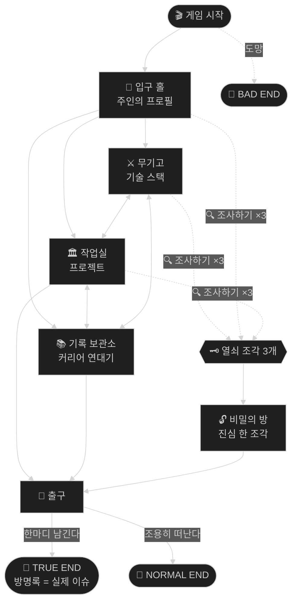

<!-- ============================================================
     🕹️ "플레이 가능한 텍스트 어드벤처" GITHUB 프로필 템플릿 (v5)
     컨셉: README 자체가 게임입니다. 방문자는 선택지를 '클릭'하며
     당신이라는 던전을 탐험하고, 3가지 엔딩 중 하나에 도달합니다.

     이 버전만의 특수 기능:
       · 페이지 내 앵커 점프로 구현한 진짜 '선택지 클릭' 게임플레이
         (JS 없이 순수 마크다운/HTML만으로 분기형 내러티브 구현)
       · <a id> 명시적 앵커 — 한글 제목에서도 링크가 절대 안 깨짐
       · 방마다 <details>로 숨겨진 "조사하기" 상호작용
       · Mermaid 던전 지도 (전체 구조 공략맵)
       · 멀티 엔딩 3종 — 엔딩 중 하나는 실제 연락(이슈)으로 이어짐
       · 소스 코드를 열어야만 얻는 히든 아이템

     ⚠️ 수정 시 주의: 선택지 링크는 <a id="..."></a> 앵커와 짝입니다.
        방을 지우면 그 방으로 가는 선택지 링크도 함께 지워주세요.

     사용법: YOUR_USERNAME 전체 치환 → [대괄호] 교체 → README.md로 개명
     ============================================================ -->

<a id="start"></a>

<div align="center">

```text
╔════════════════════════════════════════════════════╗
║                                                    ║
║        T H E   D U N G E O N   O F                 ║
║        Y O U R _ U S E R N A M E                   ║
║                                                    ║
║     ~ 이 README는 클릭으로 플레이하는 게임입니다 ~     ║
║                                                    ║
╚════════════════════════════════════════════════════╝
```

당신은 낡은 저장소(Repository) 앞에 서 있다.
문 위에는 이렇게 새겨져 있다: **"[좌우명 또는 의미심장한 한 줄]"**

문이 천천히 열린다. 들어가겠는가?

### ➤ [**게임 시작** — 문을 열고 들어간다](#room-entrance)

<sub>[겁먹고 도망친다](#ending-coward) · 🗺️ [공략맵부터 본다](#map)</sub>

</div>

---

<a id="room-entrance"></a>

## 🚪 입구 홀

횃불이 하나둘 켜진다. 홀 중앙의 석판에 이 던전의 주인에 대한 기록이 있다.

```yaml
던전의 주인: "[이름]"
직업: "[직군]"
서식지: "[지역]"
성향: "[성격이나 일하는 스타일 한 줄]"
현재 상태: "[지금 하고 있는 일 — 예: OO를 만드는 중]"
위험도: "무해함 (단, 코드 리뷰 시 돌변)"
```

<details>
<summary>🔍 <b>석판 뒷면을 조사한다</b></summary>
<br/>

뒷면에 작게 낙서가 있다: *"⚡ [재미있는 TMI 한 가지]"*

그리고 그 아래 — `🗝️ 열쇠 조각 (1/3)` 을 발견했다!

</details>

**세 개의 문이 보인다. 어디로 가겠는가?**

### ➤ [⚔️ 무기고 — 주인의 기술을 살펴본다](#room-armory)
### ➤ [🏛️ 작업실 — 주인이 만든 것들을 구경한다](#room-workshop)
### ➤ [📚 기록 보관소 — 주인의 과거를 파헤친다](#room-archive)

---

<a id="room-armory"></a>

## ⚔️ 무기고

벽에 무기들이 걸려 있다. 오래 쓴 흔적이 역력한 것도, 아직 포장도 안 뜯은 것도 있다.

| 무기 | 숙련도 | 감정 결과 |
|---|---|---|
| 🗡️ **[주력 언어]** | ▰▰▰▰▰▰▰▰▰▱ | 손에 완전히 익었다. 주인의 본체. |
| 🪄 [프레임워크] | ▰▰▰▰▰▰▰▱▱▱ | [한 줄 평] |
| 🛡️ [DB/인프라] | ▰▰▰▰▰▰▱▱▱▱ | [한 줄 평] |
| 🏹 [보조 기술] | ▰▰▰▰▱▱▱▱▱▱ | [한 줄 평] |
| 📦 [찍먹한 기술] | ▰▰▱▱▱▱▱▱▱▱ | 포장만 뜯어봄. 곧 수련 예정이라고 적혀 있다. |

<details>
<summary>🔍 <b>구석의 부러진 검을 조사한다</b></summary>
<br/>

검신에 `[이제 안 쓰는 기술]` 이라고 새겨져 있다.
주인의 메모: *"[그 기술에 대한 짧은 회고 — 예: 고마웠다. 하지만 다시 만나진 말자.]"*

`🗝️ 열쇠 조각 (2/3)` 을 발견했다!

</details>

### ➤ [🏛️ 작업실로 이동한다](#room-workshop)
### ➤ [📚 기록 보관소로 이동한다](#room-archive)
<sub>[입구 홀로 돌아간다](#room-entrance)</sub>

---

<a id="room-workshop"></a>

## 🏛️ 작업실

책상 위에 완성된 작품들과 아직 돌아가고 있는 장치들이 놓여 있다.

<table>
<tr>
<td>

**🏆 [프로젝트 1 이름]**
<sub>`[스택]` `[스택]`</sub>

[어떤 문제를 왜/어떻게 풀었는지 2~3줄. 숫자가 있으면 숫자로.]

[▶ 장치를 작동해본다 (Repo)](https://github.com/YOUR_USERNAME/REPO_1)

</td>
<td>

**⚙️ [프로젝트 2 이름]**
<sub>`[스택]` `[스택]`</sub>

[한 줄 설명 + 배운 점]

[▶ 설계도를 본다 (Repo)](https://github.com/YOUR_USERNAME/REPO_2)

</td>
</tr>
</table>

<details>
<summary>🔍 <b>책상 서랍을 조사한다</b></summary>
<br/>

미완성 설계도가 잔뜩 들어있다. 맨 위 장에는 이렇게 적혀 있다:
*"다음 작품: [다음에 만들고 싶은 것]"*

서랍 바닥에서 `🗝️ 열쇠 조각 (3/3)` 을 발견했다! — **열쇠가 완성되었다.**

### ➤ [🔓 완성된 열쇠로 비밀의 방을 연다](#room-secret)

</details>

### ➤ [⚔️ 무기고로 이동한다](#room-armory)
### ➤ [📚 기록 보관소로 이동한다](#room-archive)
<sub>[슬슬 출구를 찾는다](#room-exit)</sub>

---

<a id="room-archive"></a>

## 📚 기록 보관소

주인의 연대기가 두루마리로 보관되어 있다.

```text
[연도] ── 프로그래밍과 첫 만남. "[그때의 감상 한 줄]"
[연도] ── [학교/부트캠프/독학 — 과정 한 줄]
[연도] ── [첫 실전 — 프로젝트/인턴/취업]
[연도] ── [기억에 남는 사건 — 첫 배포, 첫 장애, 수상 등]
현재   ── [지금 위치]. 다음 장은 집필 중.
```

<details>
<summary>🔍 <b>먼지 쌓인 흑역사 두루마리를 조사한다</b></summary>
<br/>

*"[웃긴 흑역사 or 초보 시절 실수 하나 — 예: main에 force push 했던 날의 기록]"*

두루마리 끝에 교훈이 적혀 있다: **"[그 실수에서 배운 것]"**

</details>

### ➤ [⚔️ 무기고로 이동한다](#room-armory)
### ➤ [🏛️ 작업실로 이동한다](#room-workshop)
### ➤ [🚪 출구로 향한다](#room-exit)

---

<a id="room-secret"></a>

## 🔓 비밀의 방

> 열쇠 조각 3개를 모두 모은 자만이 이 방을 찾는다. 잘 왔다, 집요한 탐험가여.

방 안에는 거울이 하나 있고, 주인의 진짜 목소리가 들린다:

> *"[한 단계 깊은 진심 — 개발자로서의 꿈, 되고 싶은 모습, 소중히 여기는 가치 등 2~3문장]"*

<details>
<summary>🪞 <b>거울 뒤를 조사한다 (마지막 상호작용)</b></summary>
<br/>

거울 뒤에 쪽지가 붙어 있다:

*"여기까지 온 사람은 거의 없습니다. 아래 진(true) 엔딩의 방명록에
`🗝️🗝️🗝️` 세 개를 남겨주세요. 열쇠를 다 모은 사람만 아는 암호니까요."*

</details>

### ➤ [🚪 이제 출구로 향한다](#room-exit)

---

<a id="room-exit"></a>

## 🚪 출구

던전 탐험이 끝나간다. 문 앞의 방명록지기가 묻는다.

> **"주인에게 전할 말이 있는가?"**

### ➤ [💌 **"있다"** — 방명록에 기록을 남긴다 → 진(TRUE) 엔딩](#ending-true)
### ➤ [🚶 **"없다"** — 조용히 떠난다 → 노멀 엔딩](#ending-normal)

---

<a id="ending-true"></a>

## 🌟 TRUE ENDING — 「연결」

<div align="center">

```text
축하합니다! 진 엔딩에 도달했습니다.
당신의 기록은 던전 주인에게 실제로 전달됩니다.
```

[](https://github.com/YOUR_USERNAME/YOUR_USERNAME/issues/new?title=🕹️%20던전%20클리어%20인증&body=%23%23%20탐험%20기록%0A%0A-%20가장%20기억에%20남는%20방%3A%20%0A-%20주인에게%20전할%20말%3A%20%0A-%20(비밀의%20방을%20찾았다면%20암호를%20남겨보세요)%3A%20)
[](mailto:YOUR_EMAIL@example.com)

<sub>[🔁 처음부터 다시 플레이](#start)</sub>

</div>

---

<a id="ending-normal"></a>

## 🌙 NORMAL ENDING — 「스쳐 지나간 인연」

<div align="center">

당신은 조용히 던전을 나섰다. 뒤에서 문이 닫히는 소리가 들린다.
언젠가 다시 만날지도 모른다. 그때는 <kbd>⭐ Star</kbd> 를 눌러 이 던전을 지도에 표시해두자.

<sub>[🔁 미련이 남는다 — 다시 들어간다](#room-entrance) · [💌 역시 한마디 남기고 간다](#ending-true)</sub>

</div>

---

<a id="ending-coward"></a>

## 🐔 BAD ENDING — 「용기 부족」

<div align="center">

당신은 문 앞에서 발길을 돌렸다. README 하나에 겁먹다니...
하지만 괜찮다. 세이브 포인트는 바로 위에 있다.

<sub>[🔁 심호흡하고 다시 도전한다](#start)</sub>

</div>

---

<a id="map"></a>

## 🗺️ 던전 공략맵

<sup>길 잃은 탐험가를 위한 전체 지도. 스포일러 주의.</sup>



<div align="center">
<sub>

🕹️ 순수 마크다운으로 만든 게임입니다 — JS 없음, 새로고침 없음, 100% GitHub 네이티브 ·
<!-- 🎁 히든 아이템: 소스를 열어본 당신에게 「개발자의 눈」 칭호를 드립니다. 방명록 암호에 👁️ 를 추가하면 인정. -->
소스를 열면 히든 아이템이 하나 더 있습니다.

</sub>
</div>
